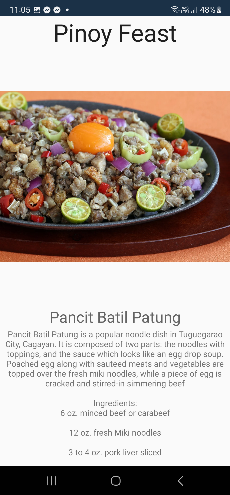
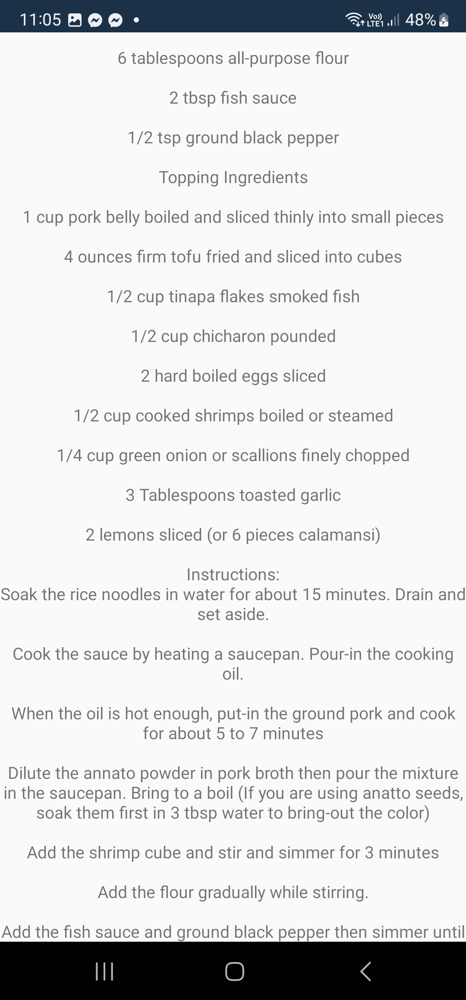
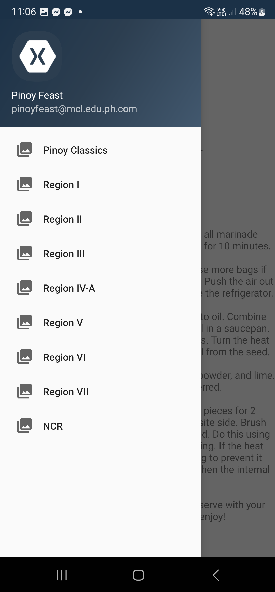
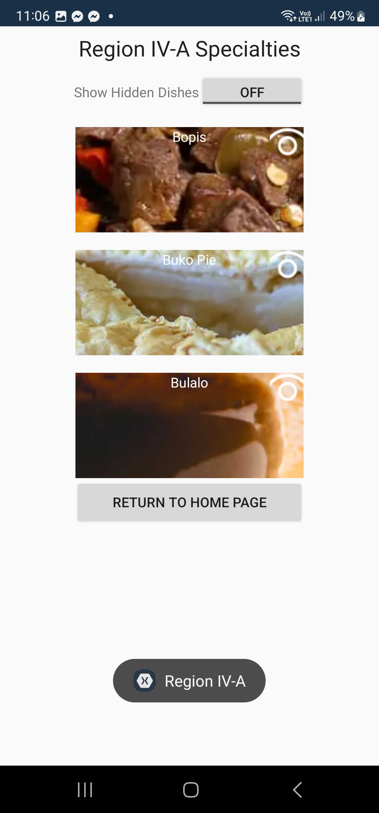
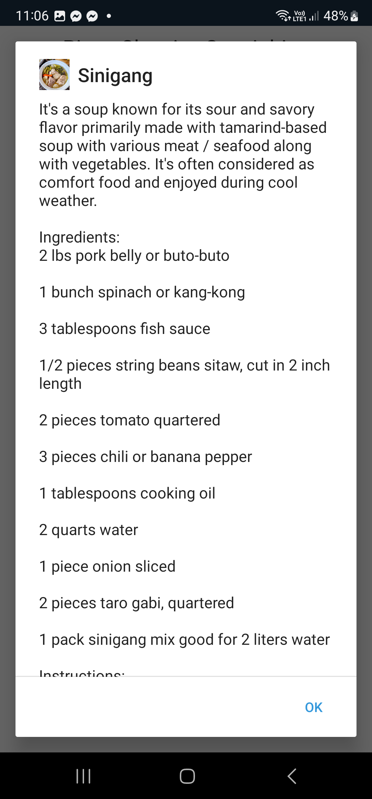
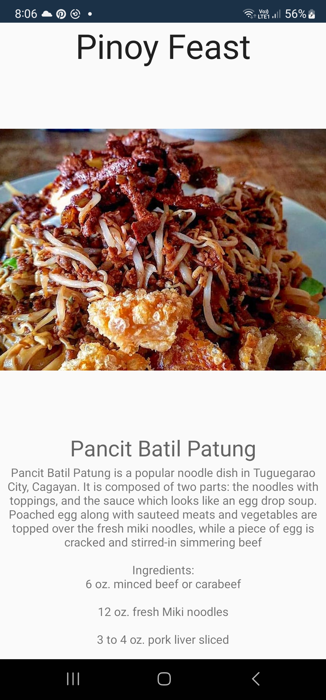
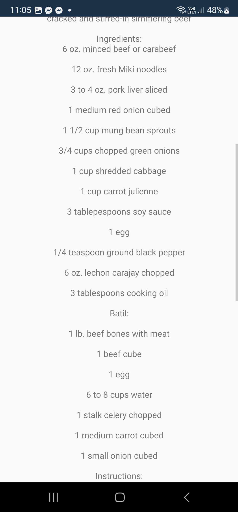
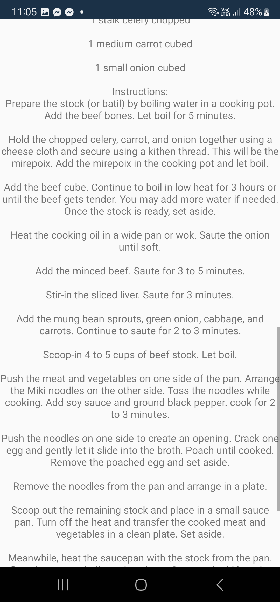
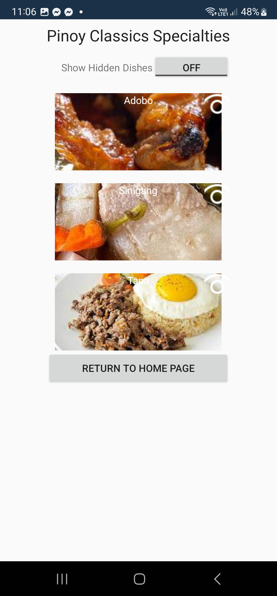
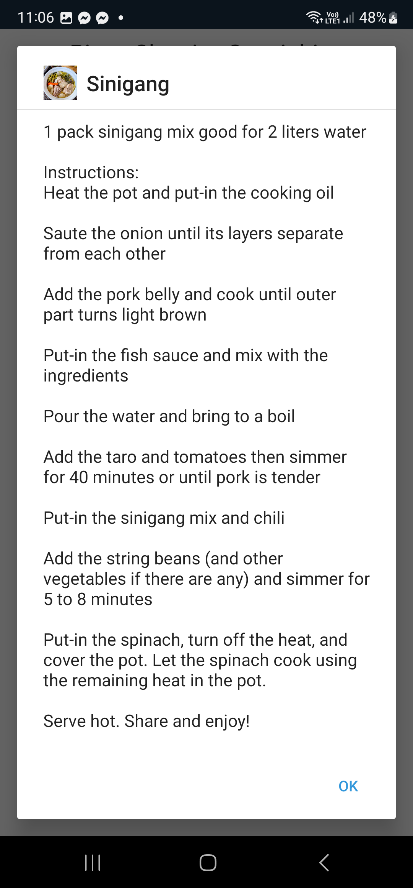

# Pinoy Feast

  <table>
    <tr>
      <td align="center">
        
         <em>Homepage</em>
      </td>
      <td align="center">
        
         <em>Dish Details</em>
      </td>
      <td align="center">
        
         <em>Drawer</em>
      </td>
    </tr>
    <tr>
      <td align="center">
        
         <em>Dish List</em>
      </td>
      <td align="center">
        
         <em>Dish Details</em>
      </td>
    </tr>
  </table>

## Project Overview
**Project Name:** Pinoy Feast  

**Course:** Computer Science

**Subject:** IT123P - INTEGRATIVE PROGRAMMING AND TECHNOLOGIES

**School:** Mapúa Malayan Colleges Laguna

**Project Date Created:** June 2023

**Group:** 7  

**Members:**  
- [Francisco, Jonard Cyrus](https://github.com/Jonard14)
- [Pineda, Zoe Aleczandra](https://github.com/zowowo)
- [Tiangsing, Leonard Reshley](https://github.com/lrtiangsing1)
- [Tolayba, Gerico](https://github.com/buffeddude69)

## Description
**Pinoy Feast** is a mobile application that showcases Filipino dishes and their rich cultural history from different provinces. Key features include:  
- **Random Dish Display:** Shows a random Filipino dish with its history upon opening the app.  
- **Interactive Navigation:** Users can browse a list of dishes to view detailed content.  
- **Content Toggle:** Content visibility can be toggled (show/hide) via database updates.  

## Features
- **Food Exploration:** Discover traditional Filipino dishes like *Batil Patung* and *Sinigang* with ingredients and recipes.  
- **Cultural Insights:** Learn about the history and regional origins of each dish.  
- **User-Friendly Interface:** Simple navigation with options to manually explore or get random suggestions.  
- **Content Visibility:** Enable/disable dish visibility dynamically.  

## Sample Dishes (From Project)
### Batil Patung
A popular noodle dish from Tuguegarao, featuring:  
- Fresh *Miki* noodles topped with sautéed meats, vegetables, and a poached egg.  
- Egg-drop soup-like sauce. 

  <table>
    <tr>
      <td align="center">
        
         <em>Homepage</em>
      </td>
      <td align="center">
        
         <em>Dish Details</em>
      </td>
      <td align="center">
        
         <em>Dish Details</em>
      </td>
    </tr>
  </table>

### Sinigang
Classic sour tamarind-based soup with:  
- Pork belly or seafood.  
- Vegetables like spinach, taro, and string beans.  

  <table>
    <tr>
      <td align="center">
        
         <em>Dish Lists</em>
      </td>
      <td align="center">
        
         <em>Dish Pop-up Details</em>
      </td>
      <td align="center">
        
         <em>Dish Pop-up Details</em>
      </td>
    </tr>
  </table>

*(See screenshots in project files for UI examples.)*  